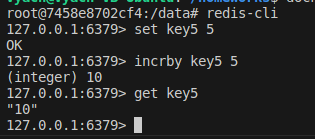

# Домашнее задание к занятию SYSDB-20 "# Кеширование Redis/memcached" - `Шорохов Вячеслав`

---

### Задание 1. Кеширование

Приведите примеры проблем, которые может решить кеширование.

_Приведите ответ в свободной форме._

#### Решение:

Кеширование решает проблемы, когда требуется быстрый доступ к часто используемым данным. Таким способом оно может увеличить скорость ответа для пользователя, так как данные не требуется заново скачивать. Сглаживает бусты трафика в моменты высокой загрузки. Экономит ресурсы и повышает производительность. Примеры кеширования, кеш браузера, кеш процессора, кеш запросов бд, кеш днс адресов.

---

### Задание 2. Memcached

Установите и запустите memcached.

_Приведите скриншот systemctl status memcached, где будет видно, что memcached запущен._

#### Решение:

`Результат работы команды systemctl status memcached:


---

### Задание 3. Удаление по TTL в Memcached

Запишите в memcached несколько ключей с любыми именами и значениями, для которых выставлен TTL 5.

_Приведите скриншот, на котором видно, что спустя 5 секунд ключи удалились из базы._

#### Решение:

Для решения задания была написана программа memcached.py:
```
from pymemcache.client import base
import requests
from datetime import datetime
import time

db = base.Client(('localhost', 11212))

db.add(key="1key", value="examle1", expire=5)
db.add(key="2key", value="examle2", expire=5)
db.add(key="3key", value="examle3", expire=5)

print(db.get("1key").decode("utf-8"))
print(db.get("2key").decode("utf-8"))
print(db.get("3key").decode("utf-8"))

now = datetime.now()
current_time = now.strftime("%H:%M:%S")
print("Current Time =" , current_time)

time.sleep(6)

print(db.get("1key"))
print(db.get("2key"))
print(db.get("3key"))

now = datetime.now()
current_time = now.strftime("%H:%M:%S")
print("Current Time =" , current_time)
```


`Результат работы программы:


---

### Задание 4. Запись данных в Redis

Запишите в Redis несколько ключей с любыми именами и значениями.

_Через redis-cli достаньте все записанные ключи и значения из базы, приведите скриншот этой операции._

#### Решение:

Для работы с Redis использовался Docker:
```
docker run --name redis.hw -d -p 63790:6379 -v redis_vol:/data redis:latest
```

`Запрос ключей и значений:


Одной операцией используя redis-cli, чтобы вывести на экран ключ и значение, получается сделать только через скрипт:
```
#!/bin/bash
for key in $(redis-cli -p 6379 keys \*);
do echo "Key : '$key'"
redis-cli -p 6379 get $key;
done
```

`Результат выполнения скрипта:


---

### Задание 5*. Работа с числами

Запишите в Redis ключ key5 со значением типа "int" равным числу 5. Увеличьте его на 5, чтобы в итоге в значении лежало число 10.

_Приведите скриншот, где будут проделаны все операции и будет видно, что значение key5 стало равно 10._

#### Решение:

`Скриншот выполнения операций:


---